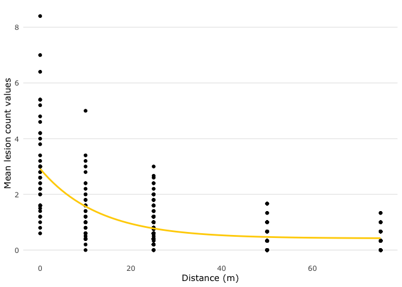

Fit Exponential Decay Models to dispersal patterns of *Ascochyta*
conidia
================
A.H. Sparks
2020-02-21

## Fit Non-linear Model

<!-- -->

    ## 
    ## Formula: mean_count_pot ~ SSasymp(dist, Asym, R0, lrc)
    ## 
    ## Parameters:
    ##      Estimate Std. Error t value Pr(>|t|)    
    ## Asym  0.41959    0.08811   4.762 2.87e-06 ***
    ## R0    2.91657    0.12372  23.575  < 2e-16 ***
    ## lrc  -2.55447    0.14010 -18.233  < 2e-16 ***
    ## ---
    ## Signif. codes:  0 '***' 0.001 '**' 0.01 '*' 0.05 '.' 0.1 ' ' 1
    ## 
    ## Residual standard error: 0.873 on 331 degrees of freedom
    ## 
    ## Number of iterations to convergence: 6 
    ## Achieved convergence tolerance: 7.212e-06
