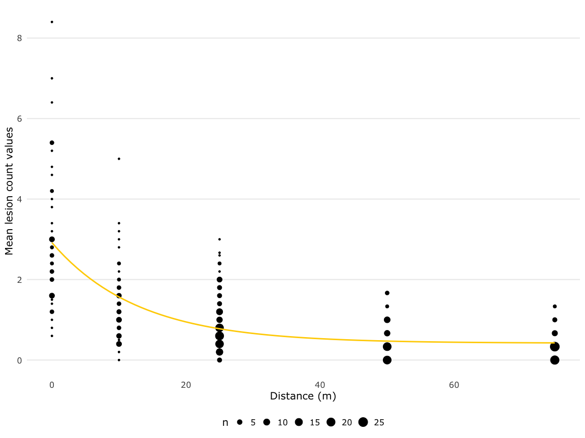
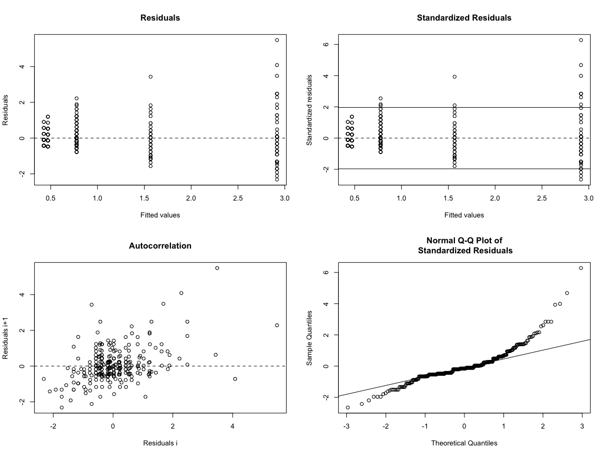

Fit Exponential Decay Models to dispersal patterns of *Ascochyta*
conidia
================
A.H. Sparks
2020-02-21

## Visualise Fit Non-linear Model

The data appear to behave like an exponential decay model. This may be
useful in the absence of more data to fit a GAM, which would be the
ideal situation.

<!-- -->

## Model

    ## 
    ## Formula: mean_count_pot ~ SSasymp(dist, Asym, R0, lrc)
    ## 
    ## Parameters:
    ##      Estimate Std. Error t value Pr(>|t|)    
    ## Asym  0.41959    0.08811   4.762 2.87e-06 ***
    ## R0    2.91657    0.12372  23.575  < 2e-16 ***
    ## lrc  -2.55447    0.14010 -18.233  < 2e-16 ***
    ## ---
    ## Signif. codes:  0 '***' 0.001 '**' 0.01 '*' 0.05 '.' 0.1 ' ' 1
    ## 
    ## Residual standard error: 0.873 on 331 degrees of freedom
    ## 
    ## Number of iterations to convergence: 6 
    ## Achieved convergence tolerance: 7.212e-06

    ## # A tibble: 1 x 8
    ##   sigma isConv     finTol logLik   AIC   BIC deviance df.residual
    ##   <dbl> <lgl>       <dbl>  <dbl> <dbl> <dbl>    <dbl>       <int>
    ## 1 0.873 TRUE   0.00000721  -427.  862.  877.     252.         331

    ## [1] "R2: 0.479022286586982"

<!-- -->

    ## 
    ## ------
    ##  Shapiro-Wilk normality test
    ## 
    ## data:  stdres
    ## W = 0.87547, p-value = 8.61e-16
    ## 
    ## 
    ## ------

    ## 
    ##  Runs Test
    ## 
    ## data:  as.factor(run)
    ## Standard Normal = -3.0204, p-value = 0.002524
    ## alternative hypothesis: two.sided

## Thoughts

The diagnostic plots don’t look so great for this data. Better starting
values might help if we optimised the nls.

The R2 value is also roughly the same as the GAMs we’ve been
looking at.

While this model may have some utility, maybe best to focus on GAMs for
the time being.
