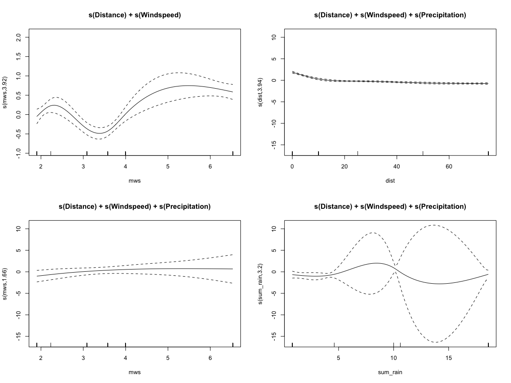
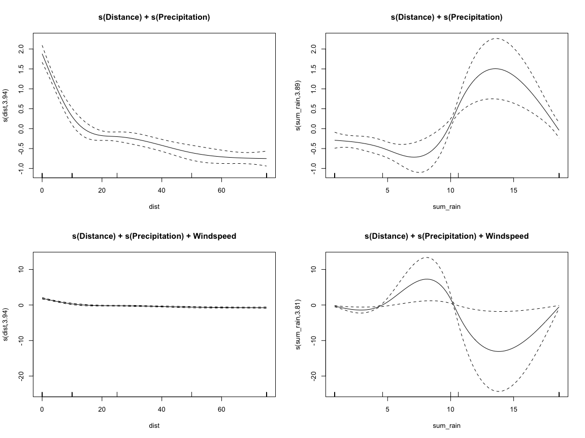

Fit GAMs to dispersal patterns of *Ascochyta* conidia
================
A.H. Sparks
2020-02-21

## Import Data

See “R/wrangle\_raw\_data.R” for the script that handles the data
import. This Rmd file focuses on the models themselves.

## Fit GAMs

### mod1 - s(Distance)

    ## 
    ## Family: gaussian 
    ## Link function: identity 
    ## 
    ## Formula:
    ## mean_count_pot ~ s(dist, k = 5)
    ## 
    ## Parametric coefficients:
    ##             Estimate Std. Error t value            Pr(>|t|)    
    ## (Intercept)   1.0802     0.0475    22.7 <0.0000000000000002 ***
    ## ---
    ## Signif. codes:  0 '***' 0.001 '**' 0.01 '*' 0.05 '.' 0.1 ' ' 1
    ## 
    ## Approximate significance of smooth terms:
    ##          edf Ref.df    F             p-value    
    ## s(dist) 3.93      4 78.4 <0.0000000000000002 ***
    ## ---
    ## Signif. codes:  0 '***' 0.001 '**' 0.01 '*' 0.05 '.' 0.1 ' ' 1
    ## 
    ## R-sq.(adj) =  0.482   Deviance explained = 48.8%
    ## GCV = 0.76522  Scale est. = 0.75394   n = 334

### mod2 - s(Distance) plus Precipitation

    ## 
    ## Family: gaussian 
    ## Link function: identity 
    ## 
    ## Formula:
    ## mean_count_pot ~ sum_rain + s(dist, k = 5)
    ## 
    ## Parametric coefficients:
    ##             Estimate Std. Error t value             Pr(>|t|)    
    ## (Intercept)   0.8169     0.0907    9.00 < 0.0000000000000002 ***
    ## sum_rain      0.0288     0.0085    3.39              0.00079 ***
    ## ---
    ## Signif. codes:  0 '***' 0.001 '**' 0.01 '*' 0.05 '.' 0.1 ' ' 1
    ## 
    ## Approximate significance of smooth terms:
    ##          edf Ref.df  F             p-value    
    ## s(dist) 3.93      4 81 <0.0000000000000002 ***
    ## ---
    ## Signif. codes:  0 '***' 0.001 '**' 0.01 '*' 0.05 '.' 0.1 ' ' 1
    ## 
    ## R-sq.(adj) =  0.498   Deviance explained = 50.5%
    ## GCV = 0.74389  Scale est. = 0.73069   n = 334

### mod3 - s(Distance) Windspeed

    ## 
    ## Family: gaussian 
    ## Link function: identity 
    ## 
    ## Formula:
    ## mean_count_pot ~ mws + s(dist, k = 5)
    ## 
    ## Parametric coefficients:
    ##             Estimate Std. Error t value  Pr(>|t|)    
    ## (Intercept)   0.6440     0.1182    5.45 0.0000001 ***
    ## mws           0.1227     0.0306    4.01 0.0000747 ***
    ## ---
    ## Signif. codes:  0 '***' 0.001 '**' 0.01 '*' 0.05 '.' 0.1 ' ' 1
    ## 
    ## Approximate significance of smooth terms:
    ##          edf Ref.df  F             p-value    
    ## s(dist) 3.93      4 82 <0.0000000000000002 ***
    ## ---
    ## Signif. codes:  0 '***' 0.001 '**' 0.01 '*' 0.05 '.' 0.1 ' ' 1
    ## 
    ## R-sq.(adj) =  0.504   Deviance explained = 51.2%
    ## GCV = 0.73389  Scale est. = 0.72086   n = 334

### mod4 - s(Distance) Windspeed plus Precipitation

    ## 
    ## Family: gaussian 
    ## Link function: identity 
    ## 
    ## Formula:
    ## mean_count_pot ~ sum_rain + mws + s(dist, k = 5)
    ## 
    ## Parametric coefficients:
    ##             Estimate Std. Error t value Pr(>|t|)    
    ## (Intercept)  0.47345    0.13152    3.60  0.00037 ***
    ## sum_rain     0.02401    0.00846    2.84  0.00481 ** 
    ## mws          0.10892    0.03066    3.55  0.00044 ***
    ## ---
    ## Signif. codes:  0 '***' 0.001 '**' 0.01 '*' 0.05 '.' 0.1 ' ' 1
    ## 
    ## Approximate significance of smooth terms:
    ##          edf Ref.df    F             p-value    
    ## s(dist) 3.93      4 83.8 <0.0000000000000002 ***
    ## ---
    ## Signif. codes:  0 '***' 0.001 '**' 0.01 '*' 0.05 '.' 0.1 ' ' 1
    ## 
    ## R-sq.(adj) =  0.515   Deviance explained = 52.3%
    ## GCV = 0.72064  Scale est. = 0.70569   n = 334

### mod5 - s(Distance + Windspeed) plus Precipitation

    ## Warning in term[i] <- attr(terms(reformulate(term[i])), "term.labels"): number
    ## of items to replace is not a multiple of replacement length

    ## 
    ## Family: gaussian 
    ## Link function: identity 
    ## 
    ## Formula:
    ## mean_count_pot ~ sum_rain + s(dist + mws, k = 5)
    ## 
    ## Parametric coefficients:
    ##             Estimate Std. Error t value             Pr(>|t|)    
    ## (Intercept)   0.8169     0.0907    9.00 < 0.0000000000000002 ***
    ## sum_rain      0.0288     0.0085    3.39              0.00079 ***
    ## ---
    ## Signif. codes:  0 '***' 0.001 '**' 0.01 '*' 0.05 '.' 0.1 ' ' 1
    ## 
    ## Approximate significance of smooth terms:
    ##          edf Ref.df  F             p-value    
    ## s(dist) 3.93      4 81 <0.0000000000000002 ***
    ## ---
    ## Signif. codes:  0 '***' 0.001 '**' 0.01 '*' 0.05 '.' 0.1 ' ' 1
    ## 
    ## R-sq.(adj) =  0.498   Deviance explained = 50.5%
    ## GCV = 0.74389  Scale est. = 0.73069   n = 334

### mod6 - s(Distance) + s(Windspeed) plus Precipitation

    ## 
    ## Family: gaussian 
    ## Link function: identity 
    ## 
    ## Formula:
    ## mean_count_pot ~ sum_rain + s(dist, k = 5) + s(mws, k = 5)
    ## 
    ## Parametric coefficients:
    ##             Estimate Std. Error t value           Pr(>|t|)    
    ## (Intercept)   1.3788     0.1668    8.27 0.0000000000000036 ***
    ## sum_rain     -0.0326     0.0176   -1.85              0.065 .  
    ## ---
    ## Signif. codes:  0 '***' 0.001 '**' 0.01 '*' 0.05 '.' 0.1 ' ' 1
    ## 
    ## Approximate significance of smooth terms:
    ##          edf Ref.df    F              p-value    
    ## s(dist) 3.94      4 93.8 < 0.0000000000000002 ***
    ## s(mws)  3.93      4 13.6        0.00000000021 ***
    ## ---
    ## Signif. codes:  0 '***' 0.001 '**' 0.01 '*' 0.05 '.' 0.1 ' ' 1
    ## 
    ## R-sq.(adj) =  0.566   Deviance explained = 57.8%
    ## GCV = 0.6497  Scale est. = 0.63051   n = 334

### mod7 - s(Distance) + s(Windspeed)

    ## 
    ## Family: gaussian 
    ## Link function: identity 
    ## 
    ## Formula:
    ## mean_count_pot ~ s(dist, k = 5) + s(mws, k = 5)
    ## 
    ## Parametric coefficients:
    ##             Estimate Std. Error t value            Pr(>|t|)    
    ## (Intercept)   1.0802     0.0437    24.7 <0.0000000000000002 ***
    ## ---
    ## Signif. codes:  0 '***' 0.001 '**' 0.01 '*' 0.05 '.' 0.1 ' ' 1
    ## 
    ## Approximate significance of smooth terms:
    ##          edf Ref.df  F              p-value    
    ## s(dist) 3.94   4.00 93 < 0.0000000000000002 ***
    ## s(mws)  3.92   3.99 16       0.000000000006 ***
    ## ---
    ## Signif. codes:  0 '***' 0.001 '**' 0.01 '*' 0.05 '.' 0.1 ' ' 1
    ## 
    ## R-sq.(adj) =  0.562   Deviance explained = 57.3%
    ## GCV = 0.65392  Scale est. = 0.63659   n = 334

### mod8 - s(Distance) + s(Windspeed) +s(Precipitation)

    ## 
    ## Family: gaussian 
    ## Link function: identity 
    ## 
    ## Formula:
    ## mean_count_pot ~ s(dist, k = 5) + s(mws, k = 5) + s(sum_rain, 
    ##     k = 5)
    ## 
    ## Parametric coefficients:
    ##             Estimate Std. Error t value            Pr(>|t|)    
    ## (Intercept)   1.0802     0.0434    24.9 <0.0000000000000002 ***
    ## ---
    ## Signif. codes:  0 '***' 0.001 '**' 0.01 '*' 0.05 '.' 0.1 ' ' 1
    ## 
    ## Approximate significance of smooth terms:
    ##              edf Ref.df     F             p-value    
    ## s(dist)     3.94   4.00 93.80 <0.0000000000000002 ***
    ## s(mws)      1.66   1.75  1.35               0.336    
    ## s(sum_rain) 3.20   3.23  3.28               0.011 *  
    ## ---
    ## Signif. codes:  0 '***' 0.001 '**' 0.01 '*' 0.05 '.' 0.1 ' ' 1
    ## 
    ## R-sq.(adj) =  0.566   Deviance explained = 57.8%
    ## GCV = 0.64956  Scale est. = 0.63051   n = 334

### mod9 - s(Distance) +s(Precipitation)

    ## 
    ## Family: gaussian 
    ## Link function: identity 
    ## 
    ## Formula:
    ## mean_count_pot ~ s(dist, k = 5) + s(sum_rain, k = 5)
    ## 
    ## Parametric coefficients:
    ##             Estimate Std. Error t value            Pr(>|t|)    
    ## (Intercept)   1.0802     0.0439    24.6 <0.0000000000000002 ***
    ## ---
    ## Signif. codes:  0 '***' 0.001 '**' 0.01 '*' 0.05 '.' 0.1 ' ' 1
    ## 
    ## Approximate significance of smooth terms:
    ##              edf Ref.df    F              p-value    
    ## s(dist)     3.94   4.00 91.8 < 0.0000000000000002 ***
    ## s(sum_rain) 3.89   3.99 15.2       0.000000000057 ***
    ## ---
    ## Signif. codes:  0 '***' 0.001 '**' 0.01 '*' 0.05 '.' 0.1 ' ' 1
    ## 
    ## R-sq.(adj) =  0.557   Deviance explained = 56.7%
    ## GCV = 0.66193  Scale est. = 0.64444   n = 334

### mod10 - s(Distance) +s(Precipitation) + Windspeed

    ## 
    ## Family: gaussian 
    ## Link function: identity 
    ## 
    ## Formula:
    ## mean_count_pot ~ s(dist, k = 5) + s(sum_rain, k = 5) + mws
    ## 
    ## Parametric coefficients:
    ##             Estimate Std. Error t value Pr(>|t|)   
    ## (Intercept)    -2.74       1.46   -1.88   0.0610 . 
    ## mws             1.07       0.41    2.62   0.0091 **
    ## ---
    ## Signif. codes:  0 '***' 0.001 '**' 0.01 '*' 0.05 '.' 0.1 ' ' 1
    ## 
    ## Approximate significance of smooth terms:
    ##              edf Ref.df    F              p-value    
    ## s(dist)     3.94   4.00 93.8 < 0.0000000000000002 ***
    ## s(sum_rain) 3.81   3.97 11.3         0.0000000081 ***
    ## ---
    ## Signif. codes:  0 '***' 0.001 '**' 0.01 '*' 0.05 '.' 0.1 ' ' 1
    ## 
    ## R-sq.(adj) =  0.566   Deviance explained = 57.8%
    ## GCV = 0.64959  Scale est. = 0.63062   n = 334

### mod11 - s(Distance) + s(Windspeed) +s(Precipitation) - Family = tw()

    ## 
    ## Family: Tweedie(p=1.044) 
    ## Link function: log 
    ## 
    ## Formula:
    ## mean_count_pot ~ s(dist, k = 5) + s(mws, k = 5) + s(sum_rain, 
    ##     k = 5)
    ## 
    ## Parametric coefficients:
    ##             Estimate Std. Error t value    Pr(>|t|)    
    ## (Intercept)   -0.228      0.041   -5.57 0.000000054 ***
    ## ---
    ## Signif. codes:  0 '***' 0.001 '**' 0.01 '*' 0.05 '.' 0.1 ' ' 1
    ## 
    ## Approximate significance of smooth terms:
    ##              edf Ref.df      F             p-value    
    ## s(dist)     3.50   3.85 123.78 <0.0000000000000002 ***
    ## s(mws)      1.98   2.08   0.77               0.487    
    ## s(sum_rain) 2.83   2.89   5.51               0.002 ** 
    ## ---
    ## Signif. codes:  0 '***' 0.001 '**' 0.01 '*' 0.05 '.' 0.1 ' ' 1
    ## 
    ## R-sq.(adj) =  0.674   Deviance explained = 61.2%
    ## -REML = 310.11  Scale est. = 0.36397   n = 334

## Compare the Models

### AIC, BIC

    ## # A tibble: 11 x 7
    ##    model    df logLik   AIC   BIC deviance df.residual
    ##    <chr> <dbl>  <dbl> <dbl> <dbl>    <dbl>       <dbl>
    ##  1 mod11  9.31  -320.  663.  709.     141.        325.
    ##  2 mod8   9.80  -392.  805.  847.     204.        324.
    ##  3 mod10  9.75  -392.  805.  846.     204.        324.
    ##  4 mod6   9.87  -392.  806.  847.     204.        324.
    ##  5 mod7   8.85  -394.  808.  845.     207.        325.
    ##  6 mod9   8.83  -396.  812.  849.     210.        325.
    ##  7 mod4   6.93  -412.  840.  871.     231.        327.
    ##  8 mod3   5.93  -416.  846.  873.     236.        328.
    ##  9 mod2   5.93  -419.  851.  877.     240.        328.
    ## 10 mod5   5.93  -419.  851.  877.     240.        328.
    ## 11 mod1   4.93  -424.  860.  883.     248.        329.

### R2

    ## # A tibble: 11 x 2
    ##    name  value
    ##    <chr> <dbl>
    ##  1 mod11 0.674
    ##  2 mod8  0.566
    ##  3 mod6  0.566
    ##  4 mod10 0.566
    ##  5 mod7  0.562
    ##  6 mod9  0.557
    ##  7 mod4  0.515
    ##  8 mod3  0.504
    ##  9 mod2  0.498
    ## 10 mod5  0.498
    ## 11 mod1  0.482

### Coefficients

    ## 
    ## mod1

    ## (Intercept)   s(dist).1   s(dist).2   s(dist).3   s(dist).4 
    ##       1.080     -13.444       7.369      -1.254      -2.292

    ## 
    ## mod2

    ## (Intercept)    sum_rain   s(dist).1   s(dist).2   s(dist).3   s(dist).4 
    ##     0.81692     0.02878   -13.40978     7.33465    -1.25209    -2.29384

    ## 
    ## mod3

    ## (Intercept)         mws   s(dist).1   s(dist).2   s(dist).3   s(dist).4 
    ##      0.6440      0.1227    -13.4869      7.3983     -1.2560     -2.2949

    ## 
    ## mod4

    ## (Intercept)    sum_rain         mws   s(dist).1   s(dist).2   s(dist).3 
    ##     0.47345     0.02401     0.10892   -13.45271     7.36613    -1.25414 
    ##   s(dist).4 
    ##    -2.29619

    ## 
    ## mod5

    ## (Intercept)    sum_rain   s(dist).1   s(dist).2   s(dist).3   s(dist).4 
    ##     0.81692     0.02878   -13.40978     7.33465    -1.25209    -2.29384

    ## 
    ## mod6

    ## (Intercept)    sum_rain   s(dist).1   s(dist).2   s(dist).3   s(dist).4 
    ##     1.37885    -0.03264   -13.52238     7.40993    -1.25717    -2.30322 
    ##    s(mws).1    s(mws).2    s(mws).3    s(mws).4 
    ##     0.99626   -10.70707     6.66915     0.59637

    ## 
    ## mod7

    ## (Intercept)   s(dist).1   s(dist).2   s(dist).3   s(dist).4    s(mws).1 
    ##      1.0802    -13.4772      7.3732     -1.2549     -2.3023      0.8682 
    ##    s(mws).2    s(mws).3    s(mws).4 
    ##     -6.5429      3.8305      0.6605

    ## 
    ## mod8

    ##   (Intercept)     s(dist).1     s(dist).2     s(dist).3     s(dist).4 
    ##        1.0802      -13.5232        7.4109       -1.2572       -2.3031 
    ##      s(mws).1      s(mws).2      s(mws).3      s(mws).4 s(sum_rain).1 
    ##        0.3909       -0.7060        1.4345        0.8083       19.7200 
    ## s(sum_rain).2 s(sum_rain).3 s(sum_rain).4 
    ##      328.5020     -102.4611        1.3525

    ## 
    ## mod9

    ##   (Intercept)     s(dist).1     s(dist).2     s(dist).3     s(dist).4 
    ##         1.080       -13.506         7.399        -1.256        -2.302 
    ## s(sum_rain).1 s(sum_rain).2 s(sum_rain).3 s(sum_rain).4 
    ##        -7.708      -109.361        34.329        -1.331

    ## 
    ## mod10

    ##   (Intercept)           mws     s(dist).1     s(dist).2     s(dist).3 
    ##        -2.741         1.075       -13.510         7.402        -1.257 
    ##     s(dist).4 s(sum_rain).1 s(sum_rain).2 s(sum_rain).3 s(sum_rain).4 
    ##        -2.302        82.075      1298.724      -407.240         8.651

    ## 
    ## mod11

    ##   (Intercept)     s(dist).1     s(dist).2     s(dist).3     s(dist).4 
    ##       -0.2282       -3.7637        1.8984       -0.5265       -1.1209 
    ##      s(mws).1      s(mws).2      s(mws).3      s(mws).4 s(sum_rain).1 
    ##        0.5077       -1.0677        1.5218        0.4780       -0.9318 
    ## s(sum_rain).2 s(sum_rain).3 s(sum_rain).4 
    ##        5.0627       -1.2860       -0.9520

### ANOVA

    ## Analysis of Deviance Table
    ## 
    ## Model  1: mean_count_pot ~ s(dist, k = 5)
    ## Model  2: mean_count_pot ~ sum_rain + s(dist, k = 5)
    ## Model  3: mean_count_pot ~ mws + s(dist, k = 5)
    ## Model  4: mean_count_pot ~ sum_rain + mws + s(dist, k = 5)
    ## Model  5: mean_count_pot ~ sum_rain + s(dist + mws, k = 5)
    ## Model  6: mean_count_pot ~ sum_rain + s(dist, k = 5) + s(mws, k = 5)
    ## Model  7: mean_count_pot ~ s(dist, k = 5) + s(mws, k = 5)
    ## Model  8: mean_count_pot ~ s(dist, k = 5) + s(mws, k = 5) + s(sum_rain, 
    ##     k = 5)
    ## Model  9: mean_count_pot ~ s(dist, k = 5) + s(sum_rain, k = 5)
    ## Model 10: mean_count_pot ~ s(dist, k = 5) + s(sum_rain, k = 5) + mws
    ## Model 11: mean_count_pot ~ s(dist, k = 5) + s(mws, k = 5) + s(sum_rain, 
    ##     k = 5)
    ##    Resid. Df Resid. Dev        Df Deviance        F               Pr(>F)    
    ## 1        329        248                                                     
    ## 2        328        240  1.000198        8    23.02           0.00000244 ***
    ## 3        328        236  0.000171        3 51787.26           0.00000021 ***
    ## 4        327        231  1.000114        6    15.62           0.00009506 ***
    ## 5        328        240 -1.000285       -9    24.47           0.00000121 ***
    ## 6        324        204  3.996713       35    24.30 < 0.0000000000000002 ***
    ## 7        325        207 -1.001004       -3     7.17              0.00776 ** 
    ## 8        324        204  0.985287        3     7.17              0.00806 ** 
    ## 9        325        210 -0.991462       -5    14.25              0.00020 ***
    ## 10       324        204  0.976439        5    14.28              0.00021 ***
    ## 11       324        640  0.386525     -435                                  
    ## ---
    ## Signif. codes:  0 '***' 0.001 '**' 0.01 '*' 0.05 '.' 0.1 ' ' 1

### Visualise the Models

<!-- --><!-- --><!-- --><!-- --><!-- -->
