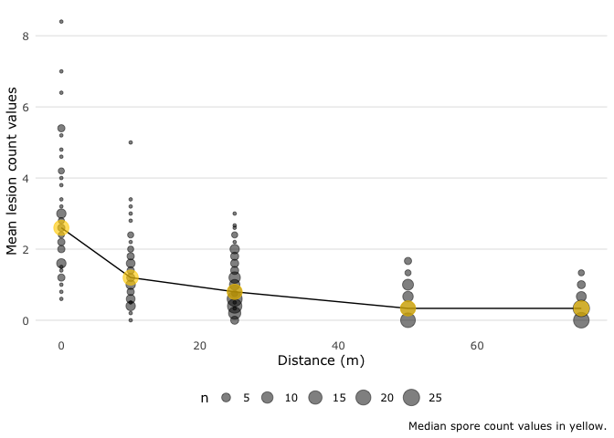
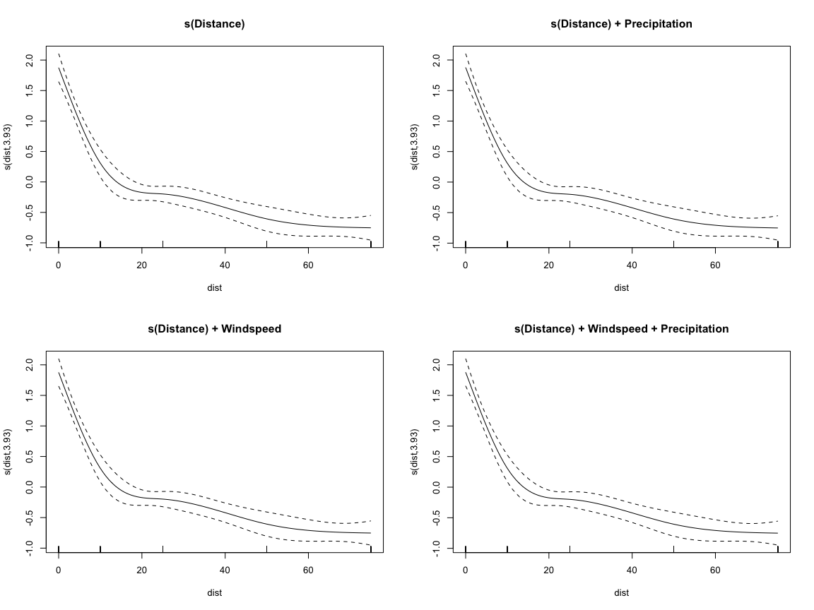
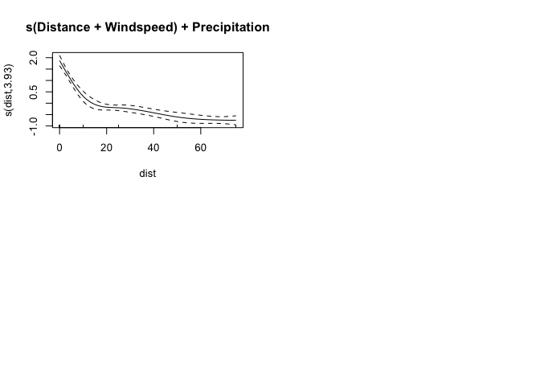

Fit GAMs to dispersal patterns of *Ascochyta* conidia
================
A.H. Sparks
2020-02-20

## Import Data

See “R/wrangle\_raw\_data.R” for the script that handles the data
import. This Rmd file focuses on the models themselves.

|                                                  |      |
| :----------------------------------------------- | :--- |
| Name                                             | dat  |
| Number of rows                                   | 336  |
| Number of columns                                | 29   |
| \_\_\_\_\_\_\_\_\_\_\_\_\_\_\_\_\_\_\_\_\_\_\_   |      |
| Column type frequency:                           |      |
| character                                        | 3    |
| factor                                           | 7    |
| numeric                                          | 19   |
| \_\_\_\_\_\_\_\_\_\_\_\_\_\_\_\_\_\_\_\_\_\_\_\_ |      |
| Group variables                                  | None |

Data summary

**Variable type: character**

| skim\_variable | n\_missing | complete\_rate | min | max | empty | n\_unique | whitespace |
| :------------- | ---------: | -------------: | --: | --: | ----: | --------: | ---------: |
| distance       |          0 |              1 |   3 |   4 |     0 |         5 |          0 |
| dist\_stat     |          0 |              1 |   4 |   6 |     0 |        38 |          0 |
| ptype          |          0 |              1 |   4 |   7 |     0 |         2 |          0 |

**Variable type: factor**

| skim\_variable | n\_missing | complete\_rate | ordered | n\_unique |            top\_counts             |
| :------------- | ---------: | -------------: | :------ | --------: | :--------------------------------: |
| SpEv           |          0 |              1 | FALSE   |         6 | Cur: 56, Hor: 56, Hor: 56, pbc: 56 |
| site           |          0 |              1 | FALSE   |         3 |    pbc: 168, Hor: 112, Cur: 56     |
| rep            |          0 |              1 | FALSE   |         3 |       1: 168, 2: 112, 3: 56        |
| station        |          0 |              1 | FALSE   |        10 |     1: 48, 2: 48, 3: 48, 4: 48     |
| transect       |          0 |              1 | FALSE   |        10 |    1: 48, 4: 48, 7: 48, 10: 48     |
| plant\_no      |          0 |              1 | FALSE   |         2 |           5: 216, 3: 120           |
| pot\_no        |          0 |              1 | FALSE   |        56 |       1: 6, 2: 6, 3: 6, 4: 6       |

**Variable type: numeric**

| skim\_variable   | n\_missing | complete\_rate |   mean |    sd |     p0 |    p25 |    p50 |    p75 |   p100 | hist  |
| :--------------- | ---------: | -------------: | -----: | ----: | -----: | -----: | -----: | -----: | -----: | :---- |
| counts\_p1       |          2 |           0.99 |   1.24 |  1.69 |   0.00 |   0.00 |   1.00 |   2.00 |  12.00 | ▇▁▁▁▁ |
| counts\_p2       |          2 |           0.99 |   1.02 |  1.39 |   0.00 |   0.00 |   0.00 |   2.00 |   8.00 | ▇▂▁▁▁ |
| counts\_p3       |          2 |           0.99 |   1.10 |  1.61 |   0.00 |   0.00 |   0.00 |   2.00 |  11.00 | ▇▁▁▁▁ |
| counts\_p4       |        124 |           0.63 |   1.41 |  1.78 |   0.00 |   0.00 |   1.00 |   2.00 |  11.00 | ▇▂▁▁▁ |
| counts\_p5       |        132 |           0.61 |   1.33 |  1.88 |   0.00 |   0.00 |   1.00 |   2.00 |  14.00 | ▇▁▁▁▁ |
| mean\_count\_pot |          2 |           0.99 |   1.08 |  1.21 |   0.00 |   0.33 |   0.67 |   1.40 |   8.40 | ▇▂▁▁▁ |
| SD\_count\_pot   |          2 |           0.99 |   0.92 |  0.69 |   0.00 |   0.55 |   0.84 |   1.30 |   4.39 | ▇▆▁▁▁ |
| mat              |          0 |           1.00 |  13.08 |  1.18 |  11.28 |  12.25 |  12.97 |  14.24 |  14.80 | ▃▃▇▁▇ |
| mah              |          0 |           1.00 |  71.21 |  3.95 |  64.03 |  70.04 |  71.06 |  74.45 |  76.64 | ▂▁▇▁▅ |
| minws            |          0 |           1.00 |   1.83 |  0.94 |   0.78 |   1.03 |   1.75 |   1.99 |   3.67 | ▇▃▇▁▃ |
| mws              |          0 |           1.00 |   3.55 |  1.52 |   1.90 |   2.23 |   3.33 |   4.00 |   6.53 | ▇▇▃▁▃ |
| maxws            |          0 |           1.00 |   5.82 |  2.29 |   3.36 |   3.74 |   5.40 |   6.73 |  10.27 | ▇▇▃▁▃ |
| mwd              |          0 |           1.00 | 253.25 | 43.40 | 203.10 | 211.38 | 249.29 | 272.80 | 333.65 | ▇▃▇▁▃ |
| precip           |          0 |           1.00 |   5.01 |  5.00 |   0.00 |   0.01 |   5.01 |  10.00 |  10.00 | ▇▁▁▁▇ |
| mdp              |          0 |           1.00 |  16.37 | 16.04 |   5.57 |   7.43 |   7.66 |  20.69 |  62.64 | ▇▁▁▁▁ |
| mrain            |          0 |           1.00 |   0.00 |  0.00 |   0.00 |   0.00 |   0.00 |   0.00 |   0.00 | ▇▁▁▁▂ |
| dist             |          0 |           1.00 |  32.68 | 24.95 |   0.00 |  10.00 |  25.00 |  50.00 |  75.00 | ▆▇▁▃▃ |
| rainfall         |          0 |           1.00 |   5.01 |  5.00 |   0.00 |   0.01 |   5.01 |  10.00 |  10.00 | ▇▁▁▁▇ |
| sum\_rain        |          0 |           1.00 |   9.10 |  5.53 |   0.80 |   4.60 |  10.00 |  10.60 |  18.60 | ▂▂▇▁▂ |

## Visualise the Dispersal Data

``` r
ggplot(dat, aes(x = dist, y = mean_count_pot)) +
   geom_count(na.rm = TRUE, alpha = 0.5) +
   stat_summary(fun.y = "median",
                geom = "line",
                na.rm = TRUE) +
   stat_summary(
      fun.y = "median",
      colour = usq_cols("usq yellow"),
      na.rm = TRUE,
      size = 5.5,
      geom = "point",
      alpha = 0.65
   ) +
   theme_usq() +
   ylab("Mean lesion count values") +
   xlab("Distance (m)") +
   labs(caption = "Median lesion count values in yellow.")
```

<!-- -->

## Fit GAMs

### mod1 - s(Distance)

    ## 
    ## Family: gaussian 
    ## Link function: identity 
    ## 
    ## Formula:
    ## mean_count_pot ~ s(dist, k = 5)
    ## 
    ## Parametric coefficients:
    ##             Estimate Std. Error t value            Pr(>|t|)    
    ## (Intercept)   1.0802     0.0475    22.7 <0.0000000000000002 ***
    ## ---
    ## Signif. codes:  0 '***' 0.001 '**' 0.01 '*' 0.05 '.' 0.1 ' ' 1
    ## 
    ## Approximate significance of smooth terms:
    ##          edf Ref.df    F             p-value    
    ## s(dist) 3.93      4 78.4 <0.0000000000000002 ***
    ## ---
    ## Signif. codes:  0 '***' 0.001 '**' 0.01 '*' 0.05 '.' 0.1 ' ' 1
    ## 
    ## R-sq.(adj) =  0.482   Deviance explained = 48.8%
    ## GCV = 0.76522  Scale est. = 0.75394   n = 334

### mod2 - s(Distance) plus Precipitation

    ## 
    ## Family: gaussian 
    ## Link function: identity 
    ## 
    ## Formula:
    ## mean_count_pot ~ sum_rain + s(dist, k = 5)
    ## 
    ## Parametric coefficients:
    ##             Estimate Std. Error t value             Pr(>|t|)    
    ## (Intercept)   0.8169     0.0907    9.00 < 0.0000000000000002 ***
    ## sum_rain      0.0288     0.0085    3.39              0.00079 ***
    ## ---
    ## Signif. codes:  0 '***' 0.001 '**' 0.01 '*' 0.05 '.' 0.1 ' ' 1
    ## 
    ## Approximate significance of smooth terms:
    ##          edf Ref.df  F             p-value    
    ## s(dist) 3.93      4 81 <0.0000000000000002 ***
    ## ---
    ## Signif. codes:  0 '***' 0.001 '**' 0.01 '*' 0.05 '.' 0.1 ' ' 1
    ## 
    ## R-sq.(adj) =  0.498   Deviance explained = 50.5%
    ## GCV = 0.74389  Scale est. = 0.73069   n = 334

### mod3 - s(Distance) Windspeed

    ## 
    ## Family: gaussian 
    ## Link function: identity 
    ## 
    ## Formula:
    ## mean_count_pot ~ mws + s(dist, k = 5)
    ## 
    ## Parametric coefficients:
    ##             Estimate Std. Error t value  Pr(>|t|)    
    ## (Intercept)   0.6440     0.1182    5.45 0.0000001 ***
    ## mws           0.1227     0.0306    4.01 0.0000747 ***
    ## ---
    ## Signif. codes:  0 '***' 0.001 '**' 0.01 '*' 0.05 '.' 0.1 ' ' 1
    ## 
    ## Approximate significance of smooth terms:
    ##          edf Ref.df  F             p-value    
    ## s(dist) 3.93      4 82 <0.0000000000000002 ***
    ## ---
    ## Signif. codes:  0 '***' 0.001 '**' 0.01 '*' 0.05 '.' 0.1 ' ' 1
    ## 
    ## R-sq.(adj) =  0.504   Deviance explained = 51.2%
    ## GCV = 0.73389  Scale est. = 0.72086   n = 334

### mod4 - s(Distance) Windspeed plus Precipitation

    ## 
    ## Family: gaussian 
    ## Link function: identity 
    ## 
    ## Formula:
    ## mean_count_pot ~ sum_rain + mws + s(dist, k = 5)
    ## 
    ## Parametric coefficients:
    ##             Estimate Std. Error t value Pr(>|t|)    
    ## (Intercept)  0.47345    0.13152    3.60  0.00037 ***
    ## sum_rain     0.02401    0.00846    2.84  0.00481 ** 
    ## mws          0.10892    0.03066    3.55  0.00044 ***
    ## ---
    ## Signif. codes:  0 '***' 0.001 '**' 0.01 '*' 0.05 '.' 0.1 ' ' 1
    ## 
    ## Approximate significance of smooth terms:
    ##          edf Ref.df    F             p-value    
    ## s(dist) 3.93      4 83.8 <0.0000000000000002 ***
    ## ---
    ## Signif. codes:  0 '***' 0.001 '**' 0.01 '*' 0.05 '.' 0.1 ' ' 1
    ## 
    ## R-sq.(adj) =  0.515   Deviance explained = 52.3%
    ## GCV = 0.72064  Scale est. = 0.70569   n = 334

### mod5 - s(Distance + Windspeed) plus Precipitation

    ## Warning in term[i] <- attr(terms(reformulate(term[i])), "term.labels"): number
    ## of items to replace is not a multiple of replacement length

    ## 
    ## Family: gaussian 
    ## Link function: identity 
    ## 
    ## Formula:
    ## mean_count_pot ~ sum_rain + s(dist + mws, k = 5)
    ## 
    ## Parametric coefficients:
    ##             Estimate Std. Error t value             Pr(>|t|)    
    ## (Intercept)   0.8169     0.0907    9.00 < 0.0000000000000002 ***
    ## sum_rain      0.0288     0.0085    3.39              0.00079 ***
    ## ---
    ## Signif. codes:  0 '***' 0.001 '**' 0.01 '*' 0.05 '.' 0.1 ' ' 1
    ## 
    ## Approximate significance of smooth terms:
    ##          edf Ref.df  F             p-value    
    ## s(dist) 3.93      4 81 <0.0000000000000002 ***
    ## ---
    ## Signif. codes:  0 '***' 0.001 '**' 0.01 '*' 0.05 '.' 0.1 ' ' 1
    ## 
    ## R-sq.(adj) =  0.498   Deviance explained = 50.5%
    ## GCV = 0.74389  Scale est. = 0.73069   n = 334

## Compare the Models

### AIC, BIC

    ## # A tibble: 5 x 7
    ##   model    df logLik   AIC   BIC deviance df.residual
    ##   <chr> <dbl>  <dbl> <dbl> <dbl>    <dbl>       <dbl>
    ## 1 mod4   6.93  -412.  840.  871.     231.        327.
    ## 2 mod3   5.93  -416.  846.  873.     236.        328.
    ## 3 mod2   5.93  -419.  851.  877.     240.        328.
    ## 4 mod5   5.93  -419.  851.  877.     240.        328.
    ## 5 mod1   4.93  -424.  860.  883.     248.        329.

### R<sup>2</sup>

    ## # A tibble: 5 x 2
    ##   name  value
    ##   <chr> <dbl>
    ## 1 mod4  0.515
    ## 2 mod5  0.515
    ## 3 mod3  0.504
    ## 4 mod2  0.498
    ## 5 mod1  0.482

### Coefficients

    ## 
    ## mod1

    ## (Intercept)   s(dist).1   s(dist).2   s(dist).3   s(dist).4 
    ##       1.080     -13.444       7.369      -1.254      -2.292

    ## 
    ## mod2

    ## (Intercept)    sum_rain   s(dist).1   s(dist).2   s(dist).3   s(dist).4 
    ##     0.81692     0.02878   -13.40978     7.33465    -1.25209    -2.29384

    ## 
    ## mod3

    ## (Intercept)         mws   s(dist).1   s(dist).2   s(dist).3   s(dist).4 
    ##      0.6440      0.1227    -13.4869      7.3983     -1.2560     -2.2949

    ## 
    ## mod4

    ## (Intercept)    sum_rain         mws   s(dist).1   s(dist).2   s(dist).3 
    ##     0.47345     0.02401     0.10892   -13.45271     7.36613    -1.25414 
    ##   s(dist).4 
    ##    -2.29619

    ## 
    ## mod5

    ## (Intercept)    sum_rain   s(dist).1   s(dist).2   s(dist).3   s(dist).4 
    ##     0.81692     0.02878   -13.40978     7.33465    -1.25209    -2.29384

### ANOVA

    ## Analysis of Deviance Table
    ## 
    ## Model 1: mean_count_pot ~ s(dist, k = 5)
    ## Model 2: mean_count_pot ~ sum_rain + s(dist, k = 5)
    ## Model 3: mean_count_pot ~ mws + s(dist, k = 5)
    ## Model 4: mean_count_pot ~ sum_rain + mws + s(dist, k = 5)
    ## Model 5: mean_count_pot ~ sum_rain + s(dist + mws, k = 5)
    ##   Resid. Df Resid. Dev        Df Deviance        F    Pr(>F)    
    ## 1       329        248                                          
    ## 2       328        240  1.000198     8.38    11.87   0.00064 ***
    ## 3       328        236  0.000171     3.22 26709.89 0.0000029 ***
    ## 4       327        231  1.000114     5.69     8.06   0.00482 ** 
    ## 5       328        240 -1.000285    -8.91    12.62   0.00044 ***
    ## ---
    ## Signif. codes:  0 '***' 0.001 '**' 0.01 '*' 0.05 '.' 0.1 ' ' 1

### Visualise the Models

<!-- --><!-- -->
