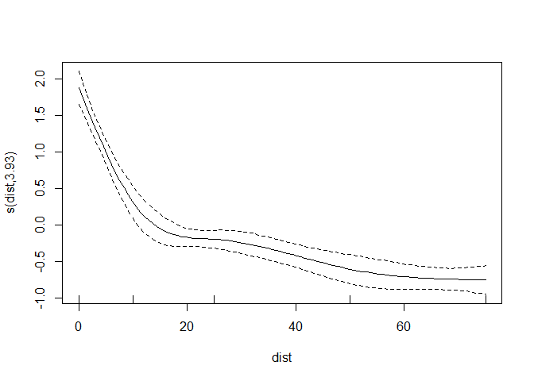
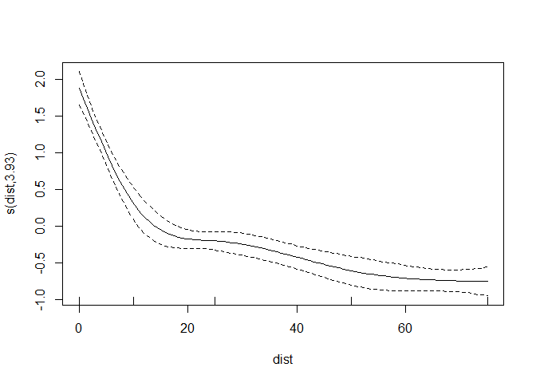

Fit GAMs to dispersal patterns of *Ascochyta* conidia
================
A.H. Sparks
2020-02-20

## Load Libraries and Import Data

``` r
library("tidyverse")
library("mgcv")
```

``` r
dat <-
   source("r/wrangle_raw_data.R")$value
```

    ## # A tibble: 336 x 28
    ## # Groups:   site, rep, transect, distance, station, mat, mah, mws, mwd [228]
    ##    site  rep   distance station transect dist_stat plant_no `pot_ no` counts_p1
    ##    <fct> <fct> <fct>      <dbl>    <dbl> <chr>        <dbl>     <dbl>     <dbl>
    ##  1 pbc   1     0 m            1        1 0m_1             5         1         1
    ##  2 pbc   1     0 m            1        1 0m_1             5         2         2
    ##  3 pbc   1     0 m            2        4 0m_2             5         3         3
    ##  4 pbc   1     0 m            2        4 0m_2             5         4         5
    ##  5 pbc   1     0 m            3        7 0m_3             5         5         3
    ##  6 pbc   1     0 m            3        7 0m_3             5         6         0
    ##  7 pbc   1     0 m            4       10 0m_4             5         7         2
    ##  8 pbc   1     0 m            4       10 0m_4             5         8         0
    ##  9 pbc   1     10 m           1        1 10m_1            5         9         0
    ## 10 pbc   1     10 m           1        1 10m_1            5        10         1
    ## # ... with 326 more rows, and 19 more variables: counts_p2 <dbl>,
    ## #   counts_p3 <dbl>, counts_p4 <dbl>, counts_p5 <dbl>, mean_count_pot <dbl>,
    ## #   SD_count_pot <dbl>, mat <dbl>, mah <dbl>, minws <dbl>, mws <dbl>,
    ## #   maxws <dbl>, mwd <dbl>, precip <dbl>, ptype <chr>, mdp <dbl>, mrain <dbl>,
    ## #   dist <dbl>, SpEv <fct>, sum_rain <dbl>

## Fit GAMs

### mod1 - s(Distance)

``` r
mod1 <-
   gam(
      mean_count_pot ~ s(dist, k = 5),
      data = dat
   )

plot(mod1)
```

<!-- -->

``` r
summary(mod1)
```

    ## 
    ## Family: gaussian 
    ## Link function: identity 
    ## 
    ## Formula:
    ## mean_count_pot ~ s(dist, k = 5)
    ## 
    ## Parametric coefficients:
    ##             Estimate Std. Error t value Pr(>|t|)    
    ## (Intercept)  1.08024    0.04751   22.74   <2e-16 ***
    ## ---
    ## Signif. codes:  0 '***' 0.001 '**' 0.01 '*' 0.05 '.' 0.1 ' ' 1
    ## 
    ## Approximate significance of smooth terms:
    ##           edf Ref.df    F p-value    
    ## s(dist) 3.926  3.996 78.4  <2e-16 ***
    ## ---
    ## Signif. codes:  0 '***' 0.001 '**' 0.01 '*' 0.05 '.' 0.1 ' ' 1
    ## 
    ## R-sq.(adj) =  0.482   Deviance explained = 48.8%
    ## GCV = 0.76522  Scale est. = 0.75394   n = 334

``` r
AIC(mod1)
```

    ## [1] 860.4022

The `k` value has to be set to 5, default is 10. Else the model will not
fit due to lack of degrees of freedom.

### mod2 - s(Distance) plus categorical value Spread Event

``` r
mod2 <-
   gam(
      mean_count_pot ~ SpEv+ s(dist, k = 5),
      data = dat
   )

plot(mod2)
```

<!-- -->

``` r
summary(mod2)
```

    ## 
    ## Family: gaussian 
    ## Link function: identity 
    ## 
    ## Formula:
    ## mean_count_pot ~ SpEv + s(dist, k = 5)
    ## 
    ## Parametric coefficients:
    ##                  Estimate Std. Error t value Pr(>|t|)    
    ## (Intercept)        0.7889     0.1081   7.300 2.24e-12 ***
    ## SpEvHorsham SPA1  -0.1954     0.1515  -1.290    0.198    
    ## SpEvHorsham SPA2   0.2492     0.1515   1.645    0.101    
    ## SpEvpbc1           0.1885     0.1515   1.244    0.214    
    ## SpEvpbc2           0.6177     0.1515   4.078 5.72e-05 ***
    ## SpEvpbc3           0.8778     0.1515   5.795 1.62e-08 ***
    ## ---
    ## Signif. codes:  0 '***' 0.001 '**' 0.01 '*' 0.05 '.' 0.1 ' ' 1
    ## 
    ## Approximate significance of smooth terms:
    ##           edf Ref.df    F p-value    
    ## s(dist) 3.938  3.997 93.8  <2e-16 ***
    ## ---
    ## Signif. codes:  0 '***' 0.001 '**' 0.01 '*' 0.05 '.' 0.1 ' ' 1
    ## 
    ## R-sq.(adj) =  0.566   Deviance explained = 57.8%
    ## GCV = 0.64985  Scale est. = 0.63051   n = 334

``` r
AIC(mod2)
```

    ## [1] 805.5882

This model fits much better and has a much lower AIC

### mod3 - s(Distance) plus mean wind speed

``` r
mod3 <-
      gam(
      mean_count_pot ~ mws+ s(dist, k = 5),
      data = dat
   )

plot(mod3)
```

<!-- -->

``` r
summary(mod3)
```

    ## 
    ## Family: gaussian 
    ## Link function: identity 
    ## 
    ## Formula:
    ## mean_count_pot ~ mws + s(dist, k = 5)
    ## 
    ## Parametric coefficients:
    ##             Estimate Std. Error t value Pr(>|t|)    
    ## (Intercept)  0.64401    0.11825   5.446 1.01e-07 ***
    ## mws          0.12273    0.03059   4.012 7.47e-05 ***
    ## ---
    ## Signif. codes:  0 '***' 0.001 '**' 0.01 '*' 0.05 '.' 0.1 ' ' 1
    ## 
    ## Approximate significance of smooth terms:
    ##           edf Ref.df     F p-value    
    ## s(dist) 3.929  3.996 81.99  <2e-16 ***
    ## ---
    ## Signif. codes:  0 '***' 0.001 '**' 0.01 '*' 0.05 '.' 0.1 ' ' 1
    ## 
    ## R-sq.(adj) =  0.504   Deviance explained = 51.2%
    ## GCV = 0.73389  Scale est. = 0.72086   n = 334

``` r
AIC(mod3)
```

    ## [1] 846.4068

mean wind speed looks like a significant linear term.

### mod3 - s(Distance ) plus wind direction

``` r
mod4 <-
   gam(
      mean_count_pot ~ mwd+ s(dist, k = 5),
      data = dat
   )

plot(mod4)
```

<!-- -->

``` r
summary(mod4)
```

    ## 
    ## Family: gaussian 
    ## Link function: identity 
    ## 
    ## Formula:
    ## mean_count_pot ~ mwd + s(dist, k = 5)
    ## 
    ## Parametric coefficients:
    ##              Estimate Std. Error t value Pr(>|t|)    
    ## (Intercept) -0.519930   0.268152  -1.939   0.0534 .  
    ## mwd          0.006311   0.001042   6.054 3.87e-09 ***
    ## ---
    ## Signif. codes:  0 '***' 0.001 '**' 0.01 '*' 0.05 '.' 0.1 ' ' 1
    ## 
    ## Approximate significance of smooth terms:
    ##           edf Ref.df     F p-value    
    ## s(dist) 3.933  3.996 86.97  <2e-16 ***
    ## ---
    ## Signif. codes:  0 '***' 0.001 '**' 0.01 '*' 0.05 '.' 0.1 ' ' 1
    ## 
    ## R-sq.(adj) =  0.532   Deviance explained = 53.9%
    ## GCV = 0.69255  Scale est. = 0.68025   n = 334

``` r
AIC(mod4)
```

    ## [1] 827.0407

Wind direction is a better linear term in comparison to wind speed as
indicated by a lower AIC, higher R-squared and lower GCV.

``` r
mod5 <-
   gam(
      mean_count_pot ~ sum_rain + s(dist, k = 5),
      data = dat
   )

plot(mod5)
```

<!-- -->

``` r
summary(mod5)
```

    ## 
    ## Family: gaussian 
    ## Link function: identity 
    ## 
    ## Formula:
    ## mean_count_pot ~ sum_rain + s(dist, k = 5)
    ## 
    ## Parametric coefficients:
    ##             Estimate Std. Error t value Pr(>|t|)    
    ## (Intercept) 0.816921   0.090724   9.004  < 2e-16 ***
    ## sum_rain    0.028779   0.008496   3.387 0.000792 ***
    ## ---
    ## Signif. codes:  0 '***' 0.001 '**' 0.01 '*' 0.05 '.' 0.1 ' ' 1
    ## 
    ## Approximate significance of smooth terms:
    ##           edf Ref.df     F p-value    
    ## s(dist) 3.928  3.996 80.95  <2e-16 ***
    ## ---
    ## Signif. codes:  0 '***' 0.001 '**' 0.01 '*' 0.05 '.' 0.1 ' ' 1
    ## 
    ## R-sq.(adj) =  0.498   Deviance explained = 50.5%
    ## GCV = 0.74389  Scale est. = 0.73069   n = 334

``` r
AIC(mod5)
```

    ## [1] 850.9272

Sum rainfall is a significant linear term, however is not as good as
wind speed or wind direction in predicting mean lesions per plant over
the whole trial

``` r
mod6 <-
   gam(
      mean_count_pot ~ sum_rain + mws+ s(dist, k = 5),
      data = dat
   )

plot(mod6)
```

<!-- -->

``` r
summary(mod6)
```

    ## 
    ## Family: gaussian 
    ## Link function: identity 
    ## 
    ## Formula:
    ## mean_count_pot ~ sum_rain + mws + s(dist, k = 5)
    ## 
    ## Parametric coefficients:
    ##             Estimate Std. Error t value Pr(>|t|)    
    ## (Intercept) 0.473449   0.131519   3.600 0.000368 ***
    ## sum_rain    0.024009   0.008457   2.839 0.004808 ** 
    ## mws         0.108916   0.030659   3.552 0.000438 ***
    ## ---
    ## Signif. codes:  0 '***' 0.001 '**' 0.01 '*' 0.05 '.' 0.1 ' ' 1
    ## 
    ## Approximate significance of smooth terms:
    ##          edf Ref.df    F p-value    
    ## s(dist) 3.93  3.996 83.8  <2e-16 ***
    ## ---
    ## Signif. codes:  0 '***' 0.001 '**' 0.01 '*' 0.05 '.' 0.1 ' ' 1
    ## 
    ## R-sq.(adj) =  0.515   Deviance explained = 52.3%
    ## GCV = 0.72064  Scale est. = 0.70569   n = 334

``` r
AIC(mod6)
```

    ## [1] 840.2809

Using both sum rainfall and mean wind speed as linear terms improves the
model fit in comparison to the `mod3`, and `mod5` when these terms were
used without the other, as evaulated by AIC and r-squared. It is still
not as good of a fit in comparison to when mean wind direction was used
as a single linear term.

``` r
mod7 <-
   gam(
      mean_count_pot ~ sum_rain + mwd + s(dist, k = 5),
      data = dat
   )

plot(mod7)
```

<!-- -->

``` r
summary(mod7)
```

    ## 
    ## Family: gaussian 
    ## Link function: identity 
    ## 
    ## Formula:
    ## mean_count_pot ~ sum_rain + mwd + s(dist, k = 5)
    ## 
    ## Parametric coefficients:
    ##              Estimate Std. Error t value Pr(>|t|)    
    ## (Intercept) -0.531791   0.266996  -1.992   0.0472 *  
    ## sum_rain     0.016937   0.008456   2.003   0.0460 *  
    ## mwd          0.005747   0.001075   5.344 1.71e-07 ***
    ## ---
    ## Signif. codes:  0 '***' 0.001 '**' 0.01 '*' 0.05 '.' 0.1 ' ' 1
    ## 
    ## Approximate significance of smooth terms:
    ##           edf Ref.df    F p-value    
    ## s(dist) 3.933  3.997 87.8  <2e-16 ***
    ## ---
    ## Signif. codes:  0 '***' 0.001 '**' 0.01 '*' 0.05 '.' 0.1 ' ' 1
    ## 
    ## R-sq.(adj) =  0.536   Deviance explained = 54.5%
    ## GCV = 0.68835  Scale est. = 0.67406   n = 334

``` r
AIC(mod7)
```

    ## [1] 824.9716

Including sum rainfall as a linear predictor with mean wind direction
barely improves the model compared to `mod4` when mean wind direction
was the only linear predictor.

``` r
mod8 <-
gam(
      mean_count_pot ~ sum_rain + s(dist + mwd, k = 5),
      data = dat
   )
```

    ## Warning in term[i] <- attr(terms(reformulate(term[i])), "term.labels"): number
    ## of items to replace is not a multiple of replacement length

``` r
plot(mod8)
```

<!-- -->

``` r
summary(mod8)
```

    ## 
    ## Family: gaussian 
    ## Link function: identity 
    ## 
    ## Formula:
    ## mean_count_pot ~ sum_rain + s(dist + mwd, k = 5)
    ## 
    ## Parametric coefficients:
    ##             Estimate Std. Error t value Pr(>|t|)    
    ## (Intercept) 0.816921   0.090724   9.004  < 2e-16 ***
    ## sum_rain    0.028779   0.008496   3.387 0.000792 ***
    ## ---
    ## Signif. codes:  0 '***' 0.001 '**' 0.01 '*' 0.05 '.' 0.1 ' ' 1
    ## 
    ## Approximate significance of smooth terms:
    ##           edf Ref.df     F p-value    
    ## s(dist) 3.928  3.996 80.95  <2e-16 ***
    ## ---
    ## Signif. codes:  0 '***' 0.001 '**' 0.01 '*' 0.05 '.' 0.1 ' ' 1
    ## 
    ## R-sq.(adj) =  0.498   Deviance explained = 50.5%
    ## GCV = 0.74389  Scale est. = 0.73069   n = 334

``` r
AIC(mod8)
```

    ## [1] 850.9272

It makes sense to look at mean wind direction as a non-linear predictor
given the premise that there is a optimum wind bearing which provides
maximum spore spread over the plots. It the wind bearing is higher or
lower than this one would expect lower number of mean lesions over the
plots.

However here we see the model does not fit correctly with two smooth
terms due to a lack of data. The model therefore preforms poorly in
comparison to all the other models.

``` r
mod9 <-
gam(
      mean_count_pot ~ sum_rain + s(dist + mws, k = 5),
      data = dat
   )
```

    ## Warning in term[i] <- attr(terms(reformulate(term[i])), "term.labels"): number
    ## of items to replace is not a multiple of replacement length

``` r
plot(mod9)
```

<!-- -->

``` r
summary(mod9)
```

    ## 
    ## Family: gaussian 
    ## Link function: identity 
    ## 
    ## Formula:
    ## mean_count_pot ~ sum_rain + s(dist + mws, k = 5)
    ## 
    ## Parametric coefficients:
    ##             Estimate Std. Error t value Pr(>|t|)    
    ## (Intercept) 0.816921   0.090724   9.004  < 2e-16 ***
    ## sum_rain    0.028779   0.008496   3.387 0.000792 ***
    ## ---
    ## Signif. codes:  0 '***' 0.001 '**' 0.01 '*' 0.05 '.' 0.1 ' ' 1
    ## 
    ## Approximate significance of smooth terms:
    ##           edf Ref.df     F p-value    
    ## s(dist) 3.928  3.996 80.95  <2e-16 ***
    ## ---
    ## Signif. codes:  0 '***' 0.001 '**' 0.01 '*' 0.05 '.' 0.1 ' ' 1
    ## 
    ## R-sq.(adj) =  0.498   Deviance explained = 50.5%
    ## GCV = 0.74389  Scale est. = 0.73069   n = 334

``` r
AIC(mod9)
```

    ## [1] 850.9272

Again we see the model does not fit correctly with two smooth terms due
to a lack of data. The model therefore preforms poorly in comparison to
all the other models.

Lets compare all the models we have fit above

``` r
AIC(mod1,mod2,mod3,mod4, mod5,mod6,mod7,mod8,mod9)
```

    ##             df      AIC
    ## mod1  5.925876 860.4022
    ## mod2 10.937628 805.5882
    ## mod3  6.929201 846.4068
    ## mod4  6.932560 827.0407
    ## mod5  6.927641 850.9272
    ## mod6  7.930263 840.2809
    ## mod7  7.932933 824.9716
    ## mod8  6.927641 850.9272
    ## mod9  6.927641 850.9272

``` r
anova(mod1,mod2,mod3,mod4, mod5, mod6,mod7,mod8,mod9, test = "F")
```

    ## Analysis of Deviance Table
    ## 
    ## Model 1: mean_count_pot ~ s(dist, k = 5)
    ## Model 2: mean_count_pot ~ SpEv + s(dist, k = 5)
    ## Model 3: mean_count_pot ~ mws + s(dist, k = 5)
    ## Model 4: mean_count_pot ~ mwd + s(dist, k = 5)
    ## Model 5: mean_count_pot ~ sum_rain + s(dist, k = 5)
    ## Model 6: mean_count_pot ~ sum_rain + mws + s(dist, k = 5)
    ## Model 7: mean_count_pot ~ sum_rain + mwd + s(dist, k = 5)
    ## Model 8: mean_count_pot ~ sum_rain + s(dist + mwd, k = 5)
    ## Model 9: mean_count_pot ~ sum_rain + s(dist + mws, k = 5)
    ##   Resid. Df Resid. Dev          Df Deviance         F    Pr(>F)    
    ## 1       329     248.10                                             
    ## 2       324     204.32  5.00122972   43.776    13.883 2.659e-12 ***
    ## 3       328     236.49 -4.00086067  -32.170    12.753 1.186e-09 ***
    ## 4       328     223.17  0.00035589   13.327 59391.703 5.907e-10 ***
    ## 5       328     239.72 -0.00052697  -16.552 49815.331 6.696e-11 ***
    ## 6       327     230.81  1.00028547    8.910    14.128 0.0002022 ***
    ## 7       327     220.46  0.00028001   10.344 58591.541 5.409e-09 ***
    ## 8       328     239.72 -1.00056547  -19.255    30.521 6.746e-08 ***
    ## 9       328     239.72  0.00000000    0.000                        
    ## ---
    ## Signif. codes:  0 '***' 0.001 '**' 0.01 '*' 0.05 '.' 0.1 ' ' 1

## Thoughts

Examining the AIC, GCV and R^2 values, the best fitting model was
`mod2`, however this model does not explain the effect of windspeed or
rainfall. The next best model fit used mean wind direction and
sum\_rain, however this term does not aid in the answering the question
we have of the data, what are the predictors which influence the
distance a spore can travel. The next best model fit that does not
include mean wind direction is `mod5` which uses sum rainfall and mean
wind speed as linear predictors.
