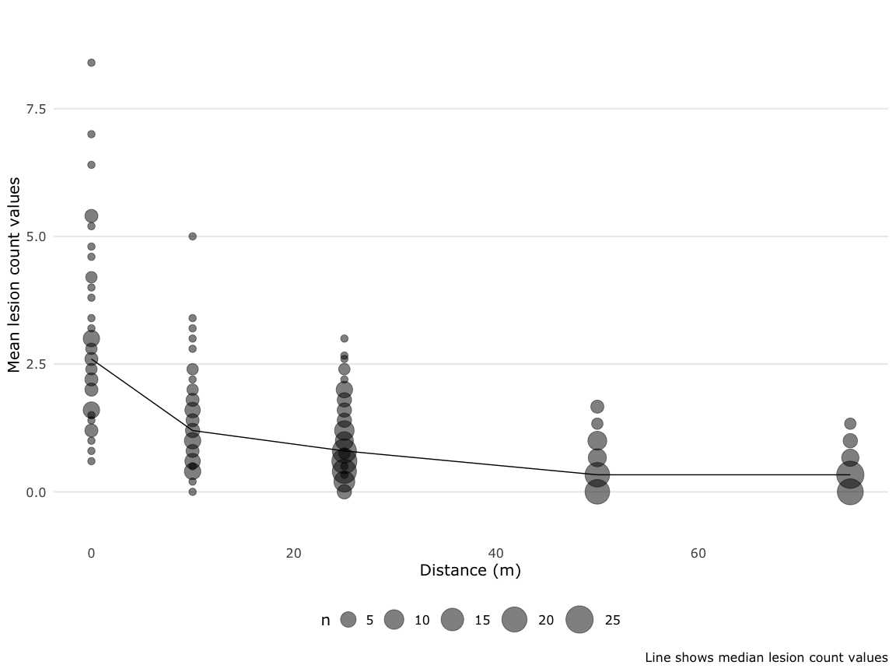
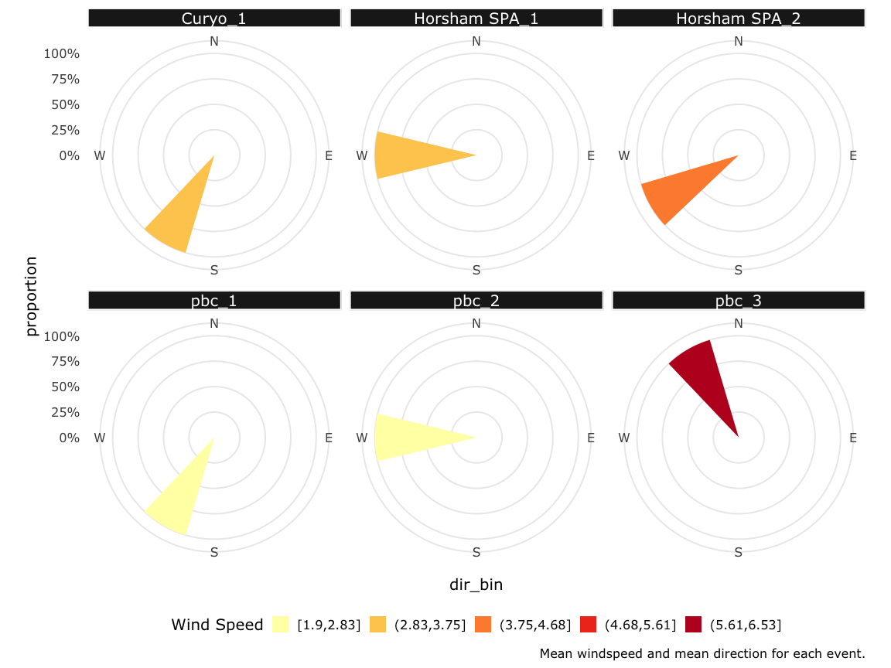

Visualise Data
================
A.H. Sparks
2020-02-21

## Import Data

See “R/wrangle\_raw\_data.R” for the script that handles the data
import. This Rmd file focuses on the models themselves.

|                                                  |      |
| :----------------------------------------------- | :--- |
| Name                                             | dat  |
| Number of rows                                   | 334  |
| Number of columns                                | 29   |
| \_\_\_\_\_\_\_\_\_\_\_\_\_\_\_\_\_\_\_\_\_\_\_   |      |
| Column type frequency:                           |      |
| character                                        | 3    |
| factor                                           | 7    |
| numeric                                          | 19   |
| \_\_\_\_\_\_\_\_\_\_\_\_\_\_\_\_\_\_\_\_\_\_\_\_ |      |
| Group variables                                  | None |

Data summary

**Variable type: character**

| skim\_variable | n\_missing | complete\_rate | min | max | empty | n\_unique | whitespace |
| :------------- | ---------: | -------------: | --: | --: | ----: | --------: | ---------: |
| distance       |          0 |              1 |   3 |   4 |     0 |         5 |          0 |
| dist\_stat     |          0 |              1 |   4 |   6 |     0 |        38 |          0 |
| ptype          |          0 |              1 |   4 |   7 |     0 |         2 |          0 |

**Variable type: factor**

| skim\_variable | n\_missing | complete\_rate | ordered | n\_unique |            top\_counts             |
| :------------- | ---------: | -------------: | :------ | --------: | :--------------------------------: |
| SpEv           |          0 |              1 | FALSE   |         6 | Hor: 56, Hor: 56, pbc: 56, pbc: 56 |
| site           |          0 |              1 | FALSE   |         3 |    pbc: 168, Hor: 112, Cur: 54     |
| rep            |          0 |              1 | FALSE   |         3 |       1: 166, 2: 112, 3: 56        |
| station        |          0 |              1 | FALSE   |        10 |     1: 48, 2: 48, 3: 48, 4: 46     |
| transect       |          0 |              1 | FALSE   |        10 |    1: 48, 7: 48, 10: 48, 4: 46     |
| plant\_no      |          0 |              1 | FALSE   |         2 |           5: 214, 3: 120           |
| pot\_no        |          0 |              1 | FALSE   |        56 |       1: 6, 2: 6, 3: 6, 4: 6       |

**Variable type: numeric**

| skim\_variable   | n\_missing | complete\_rate |   mean |    sd |     p0 |    p25 |    p50 |    p75 |   p100 | hist  |
| :--------------- | ---------: | -------------: | -----: | ----: | -----: | -----: | -----: | -----: | -----: | :---- |
| counts\_p1       |          0 |           1.00 |   1.24 |  1.69 |   0.00 |   0.00 |   1.00 |   2.00 |  12.00 | ▇▁▁▁▁ |
| counts\_p2       |          0 |           1.00 |   1.02 |  1.39 |   0.00 |   0.00 |   0.00 |   2.00 |   8.00 | ▇▂▁▁▁ |
| counts\_p3       |          0 |           1.00 |   1.10 |  1.61 |   0.00 |   0.00 |   0.00 |   2.00 |  11.00 | ▇▁▁▁▁ |
| counts\_p4       |        122 |           0.63 |   1.41 |  1.78 |   0.00 |   0.00 |   1.00 |   2.00 |  11.00 | ▇▂▁▁▁ |
| counts\_p5       |        130 |           0.61 |   1.33 |  1.88 |   0.00 |   0.00 |   1.00 |   2.00 |  14.00 | ▇▁▁▁▁ |
| mean\_count\_pot |          0 |           1.00 |   1.08 |  1.21 |   0.00 |   0.33 |   0.67 |   1.40 |   8.40 | ▇▂▁▁▁ |
| SD\_count\_pot   |          0 |           1.00 |   0.92 |  0.69 |   0.00 |   0.55 |   0.84 |   1.30 |   4.39 | ▇▆▁▁▁ |
| mat              |          0 |           1.00 |  13.07 |  1.18 |  11.28 |  12.25 |  12.80 |  14.24 |  14.80 | ▃▃▇▁▇ |
| mah              |          0 |           1.00 |  71.26 |  3.92 |  64.03 |  70.04 |  71.42 |  74.45 |  76.64 | ▂▁▇▁▅ |
| minws            |          0 |           1.00 |   1.83 |  0.94 |   0.78 |   1.03 |   1.51 |   1.99 |   3.67 | ▇▃▇▁▃ |
| mws              |          0 |           1.00 |   3.55 |  1.52 |   1.90 |   2.23 |   3.09 |   4.00 |   6.53 | ▇▇▃▁▃ |
| maxws            |          0 |           1.00 |   5.82 |  2.30 |   3.36 |   3.74 |   5.16 |   6.73 |  10.27 | ▇▇▃▁▃ |
| mwd              |          0 |           1.00 | 253.55 | 43.36 | 203.10 | 211.38 | 257.11 | 272.80 | 333.65 | ▇▃▇▁▃ |
| precip           |          0 |           1.00 |   5.04 |  5.00 |   0.00 |   0.01 |  10.00 |  10.00 |  10.00 | ▇▁▁▁▇ |
| mdp              |          0 |           1.00 |  16.29 | 16.05 |   5.57 |   7.43 |   7.66 |  19.78 |  62.64 | ▇▁▁▁▁ |
| mrain            |          0 |           1.00 |   0.00 |  0.00 |   0.00 |   0.00 |   0.00 |   0.00 |   0.00 | ▇▁▁▁▂ |
| dist             |          0 |           1.00 |  32.72 | 25.01 |   0.00 |  10.00 |  25.00 |  50.00 |  75.00 | ▆▇▁▅▅ |
| rainfall         |          0 |           1.00 |   5.04 |  5.00 |   0.00 |   0.01 |  10.00 |  10.00 |  10.00 | ▇▁▁▁▇ |
| sum\_rain        |          0 |           1.00 |   9.15 |  5.51 |   0.80 |   4.60 |  10.00 |  10.60 |  18.60 | ▂▂▇▁▂ |

## Visualise the Dispersal Data

<!-- -->

<!-- -->

## Visualise the Windspeed and Direction

<!-- -->
